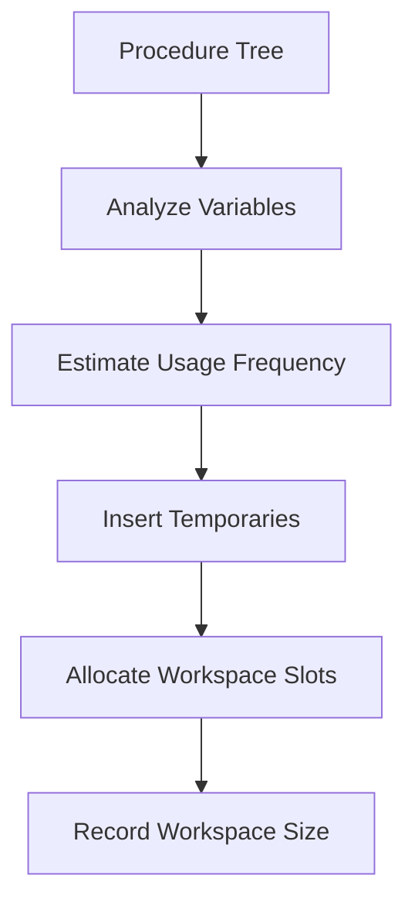
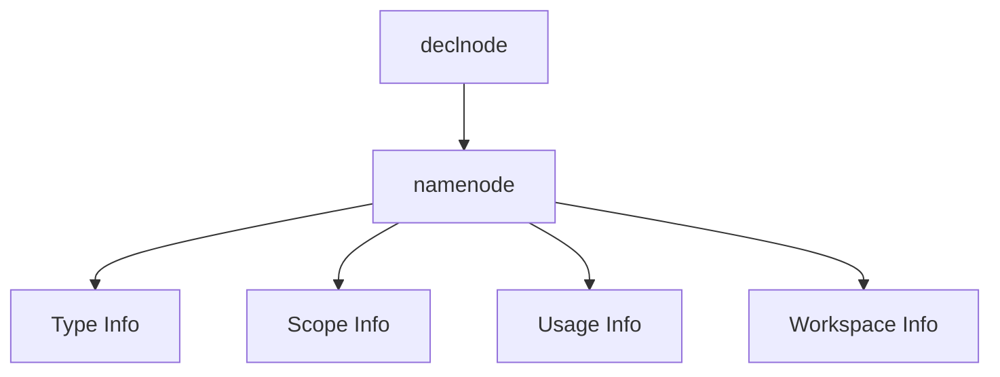

# 🧠 occam Compiler Internal Implementation Manual

> **Author:** Conor O’Neill  
> **Doc ID:** SW-0239-2  
> **Date:** Draft – Feb 20, 1991  
> **Source:** INMOS Confidential  

---

## 📌 Overview

The **occam compiler** is a multi-pass, hand-written compiler in ANSI C designed for **INMOS transputers (16-bit & 32-bit)**.

- ~70,000 LOC across ~100 files  
- No advanced optimizations (focus on architecture efficiency)  
- Tree-based internal representation  
- Shared codebase with **occam configurer**

---

## 🏗️ Compiler Architecture


---

## 📂 Project Structure

```bash
.
├── frontend/
├── backend/
├── info/
├── Makefiles
```

---

## ⚙️ Build System

### Supported Targets

| Target | Description |
|------|--------|
| `makefile.s3c` | Sun3 compiler |
| `makefile.s4c` | Sun4 compiler |
| `makefile.tpc` | Transputer bootable |

### Key Flags

| Flag | Description |
|------|------------|
| `GNU` | GCC build |
| `SUN` | SunOS |
| `TCOFF` | Required object format |
| `CONFIG` | Build configurer |
| `VIRTUALCHANS` | Enable virtual channels |

---

## 🔧 Compilation Pipeline

### 1. Lexer

- Tokenizes input
- Maintains **name table**
- Handles:
  - `#INCLUDE`
  - `#USE`
  - `#PRAGMA`

---

### 2. Parser

- Recursive descent
- Builds **AST (Abstract Syntax Tree)**
- Creates symbol entries (`namenode`)

---

### 3. Type Checker

- Resolves scope via stack
- Performs:
  - Type validation
  - Constant folding
  - Semantic checks

---

### 4. Usage & Alias Checker

- Ensures:
  - No illegal aliasing
  - Correct parallel usage
- Adds runtime checks when needed

---

### 5. Tree Transformer

- Expands `INLINE`
- Inserts:
  - Bounds checks
  - Runtime alias checks
- Simplifies expressions

---

### 6. Mapper (Workspace Allocation)



- Assigns variables to workspace (register-like)
- Introduces temporaries
- Performs limited liveness analysis

---

### 7. Debug Info Generation

- Emits symbolic debug data
- Records:
  - Variables
  - Workspace layout

---

### 8. Code Generation

- Generates machine code directly (no assembly stage)
- Writes to internal buffer

---

### 9. Code Cruncher


- Resolves labels
- Optimizes instruction encoding
- Outputs final object file

---

## 🌳 Internal Representation (AST)

All compilation phases operate on a **tree structure**.

### Tree Properties

- Each node has:
  - `tag` (node type)
  - `location` (file + line)
- Accessed via macros (no direct struct access)

---

## 🧩 Core Node Types

### Execution Nodes

| Node | Purpose |
|------|--------|
| `actionnode` | Assignments, I/O |
| `cnode` | Control constructs (`SEQ`, `PAR`, `IF`) |
| `condnode` | Conditions (`IF`, `WHILE`, `CASE`) |

---

### Data Nodes

| Node | Purpose |
|------|--------|
| `arraynode` | Array type |
| `arraysubnode` | Array indexing |
| `segmentnode` | Array slicing |

---

### Symbol & Declaration

| Node | Purpose |
|------|--------|
| `namenode` | Symbol table entry |
| `declnode` | Variable/procedure declaration |

---

### Expressions

| Node | Purpose |
|------|--------|
| `dopnode` | Binary operations |
| `mopnode` | Unary operations |
| `litnode` | Literals |
| `constexpnode` | Constants |

---

### Control & Advanced

| Node | Purpose |
|------|--------|
| `instancenode` | Function/procedure calls |
| `replcnode` | Replicated constructs |
| `spacenode` | Workspace allocation |
| `variantnode` | Variant inputs |

---

## 🗂️ Name Table

- Stores **all identifiers uniquely**
- Enables pointer-based comparison
- No scope awareness

---

## 🧮 Symbol Table

Distributed across `namenode`s.

### Structure



---

### Key Fields

- Name
- Type tree
- Declaration pointer
- Lexical level
- Usage flags

---

### Variable-Specific Data

- Workspace offset
- Memory mode:
  - `WORKSPACE`
  - `VECSPACE`
  - `POINTER`
- Usage count

---

### Procedure / Function Data

- Entry label
- Workspace size
- Parameter list
- Constant tables
- External linkage info

---

## 🧪 Developer Diagnostics

| Flag | Description |
|------|------------|
| `Z` | Backend diagnostics |
| `ZA` | Assembly output |
| `ZL` | Lexer output |
| `ZT` | Print AST |
| `ZU` | Usage checking |

---

## 🧠 Key Design Decisions

- **Tree-based IR** for flexibility
- **No optimization passes** → simpler, predictable codegen
- **Workspace allocation instead of registers**
- **Direct machine code emission**

---

## ⚠️ Limitations

- No global or interprocedural optimization  
- Platform-specific builds  
- Memory management does not reclaim AST nodes  

---

## 🚀 Summary

The occam compiler is:

- A **multi-pass compiler**
- Built around a **tree transformation pipeline**
- Optimized for **transputer architecture**
- Designed for **maintainability over aggressive optimization**

---

## 📎 Notes

- The compiler shares code with the **occam configurer**
- Built using **conditional compilation**
- Heavy use of macros for abstraction (`vti.h`)

---

## 💡 Possible Improvements (Modern Context)

- Add SSA-based optimization
- Replace manual memory with GC/arena allocator
- Introduce IR verification passes
- Modularize backend
